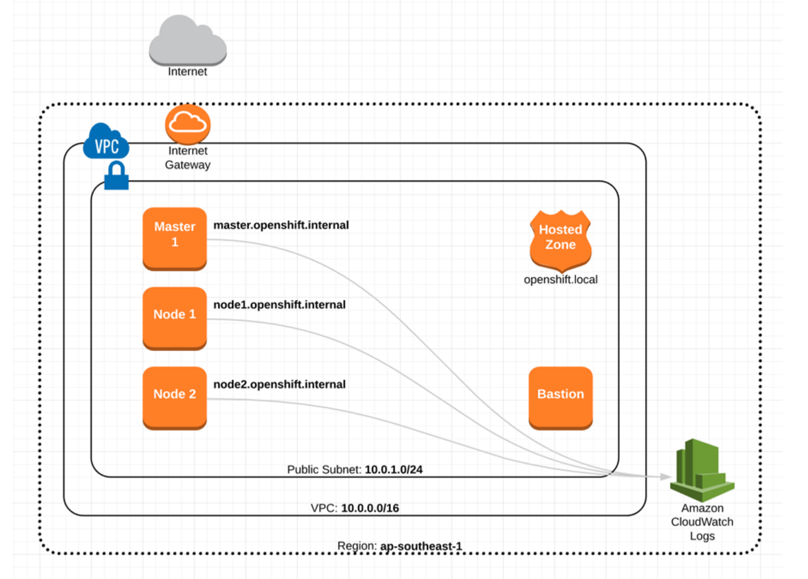
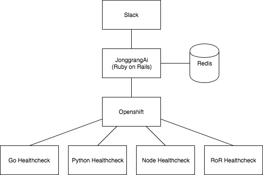

# JonggrangAi - A Continuous Delivery AI
Architecting, Monitoring, Deploying, and Mocking using AI

## What is JonggrangAi?
JonggrangAi is an AI for building, changing, and versioning infrastructure safely and efficiently. JonggrangAi can manage existing and popular service providers as well as custom in-house solutions.
The key features of JonggrangAi are:
- **Infrastructure as Code** - Infrastructure is described using a high-level configuration syntax. This allows a blueprint of your datacenter to be versioned and treated as you would any other code. Additionally, infrastructure can be shared and re-used.
- **Execution Plans** - JonggrangAi has a "planning" step where it generates an execution plan. The execution plan shows what JonggrangAi will do when you call apply. This lets you avoid any surprises when JonggrangAi manipulates infrastructure.
- **Resource Graph** - JonggrangAi builds a graph of all your resources, and parallelizes the creation and modification of any non-dependent resources. Because of this, JonggrangAi builds infrastructure as efficiently as possible, and operators get insight into dependencies in their infrastructure.
- **Change Automation** - Complex changesets can be applied to your infrastructure with minimal human interaction. With the previously mentioned execution plan and resource graph, you know exactly what JonggrangAi will change and in what order, avoiding many possible human errors.

## JonggrangAi on AWS


## How to use
1. Clone repository
```
git clone https://github.com/GO-HACKATHON/Tiger.git
```
2. Pull submodules
```
git pull --recurse-submodules && git submodule update --recursive --remote
```
3. Install and run minishift (Mac OS X only)
```
cd openshift_maker && make install && make run
```
4. Run JonggrangAi
```
cd ../jonggrang_ai && docker-compose up
```

## Stack
#### Healthcheck:
- **Go** - An open source programming language that makes it easy to build simple, reliable, and efficient software.
- **Python** - 
Widely used high-level programming language for general-purpose programming
- **Node.js** - Event-driven I/O server-side JavaScript environment based on V8
- **Ruby on Rails** - A full stack, Web application framework optimized for sustainable programming productivity, allows writing sound code by favoring convention over configuration.
<br/><br/>
#### JonggrangAi:
- **Ruby on Rails**
- **Redis** - An open source (BSD licensed), in-memory data structure store, used as a database, cache and message broker.

## Diagram


## Authors
We need new challenges!
- Gregory Sukanto<br/>
gregory.sukanto@gmail.com | 083854904403
- Made Aryadinata<br/>
madearyadinata@gmail.com | 081234696267
